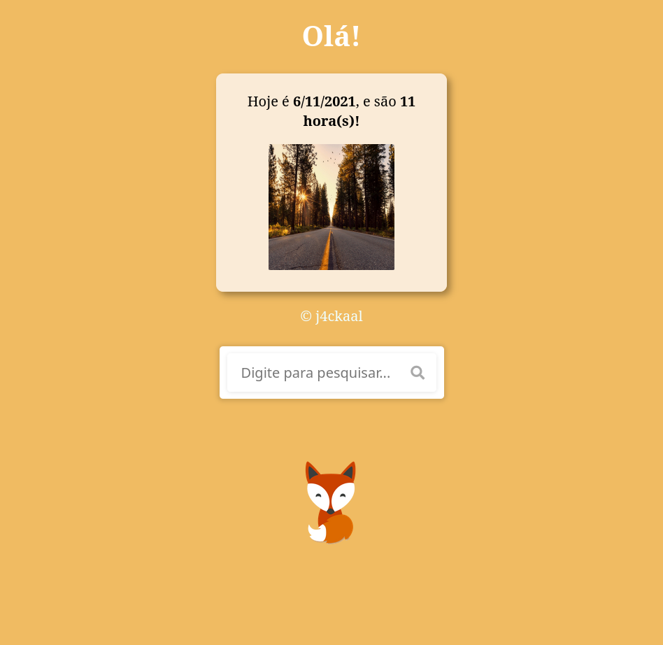
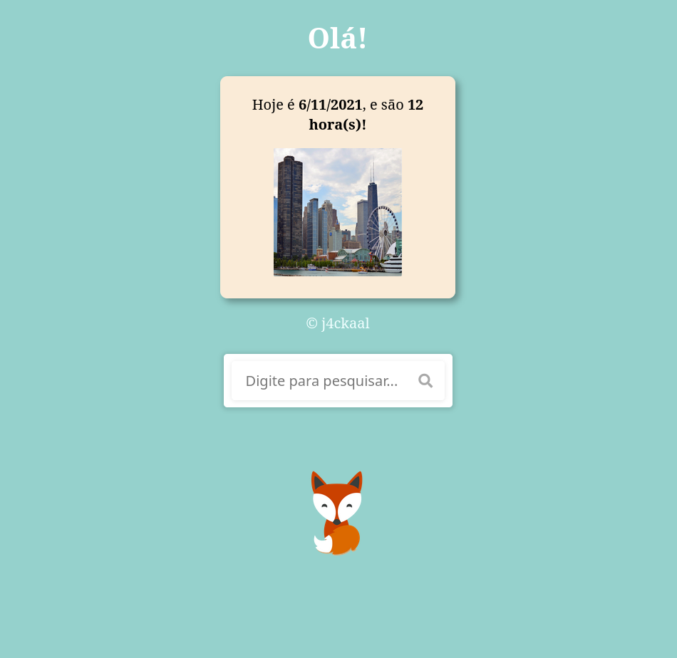
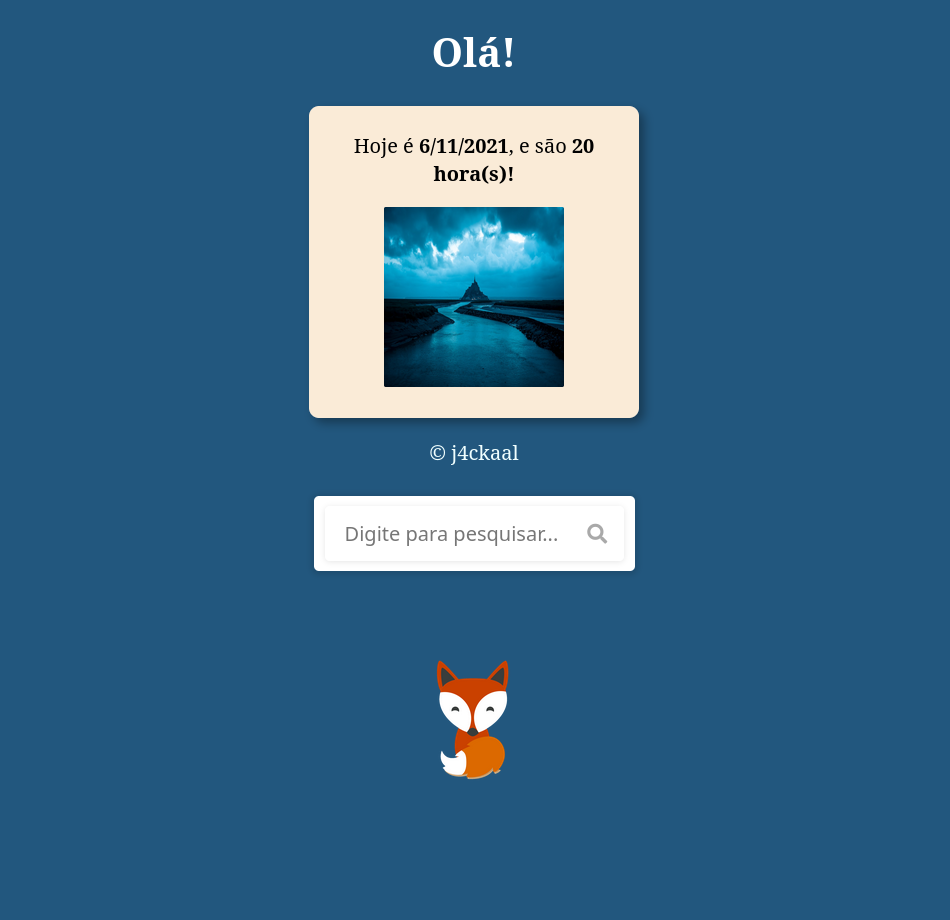

# js-initialpage

🛸    - Uma página inicial feita usando HTML, CSS e Javascript.

Features:

🔎    - Vem com uma barra de pesquisa

🌠    - A cor de fundo e a imagem são alteradas de acordo com o horário do dia!

📅    - Indica o dia, mês e ano.

📱🖥  - Funciona tanto no computador quanto em dispositivos mobile.

